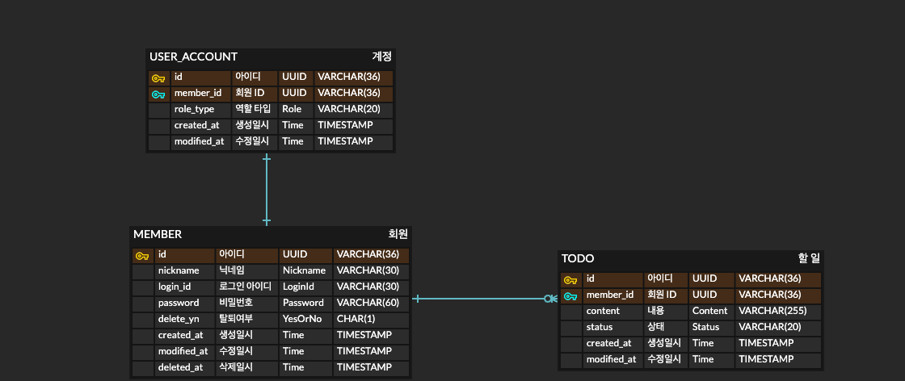

# 모아이스 과제 테스트

## TO-DO List 서비스

## 요구사항

### 비기능 요구사항
- 간단한 설계 문서.
    - API 목록, 코드 구조, 서비스 흐름 또는 추가 고려한 사항 등.
    - 실 서버를 구성했다면, 해당 서버 사용 방법.
- API는 Rest 또는 GraphQL 방식을 이용해서 설계한다.
- 주요 서비스 흐름에 따른 따른 로깅
- 회원은 닉네임을 가진다.
- 보안이 고려되어 있어야 한다.
  - ID UUID화 (Injection 방어)
  - JWT 인증
  - 비밀번호 단방향 암호화
  - 비밀번호 정책

### 기능 요구사항
- API
  - 회원
    - 회원가입
      - 필수 인자(로그인 ID, 비밀번호, 닉네임)가 존재하지 않는 경우 예외가 발생한다.
      - 로그인 ID가 중복되는 경우 예외가 발생한다.
      - 로그인 ID, 닉네임의 입력이 최대 길이가 넘어가는 경우 예외가 발생한다.
      - 비밀번호 정책
        - 최소 8자리 이상의 비밀번호여야 한다.
        - 특수 문자(!, @, #, $, %) 중 하나 이상을 포함해야 한다.
        - 하나 이상의 숫자를 포함해야 한다.
        - 하나 이상의 영어 소문자를 포함해야 한다.
        - 영어 대문자는 허용이지만 필수는 아니다.
    - 로그인
      - 필수 인자(로그인 ID, 비밀번호)가 존재하지 않는 경우 예외가 발생한다. 
      - 로그인 ID에 해당하는 회원이 존재하지 않는 경우 예외가 발생한다.
      - 비밀번호가 일치하지 않는 경우 예외가 발생한다.
    - 회원탈퇴
      - 액세스 토큰이 존재하지 않는 경우 예외가 발생한다.
      - 필수 인자(로그인 ID, 비밀번호)가 존재하지 않는 경우 예외가 발생한다.
      - 토큰의 payload로 조회한 데이터와 입력한 데이터(로그인 ID, 비밀번호)가 일치하지 않는 경우 예외가 발생한다.
  - TODO
    - 추가
      - 액세스 토큰이 존재하지 않는 경우 예외가 발생한다. 
      - 필수 인자(내용)가 존재하지 않는 경우 예외가 발생한다.
      - 내용의 입력이 최대 길이가 넘어가는 경우 예외가 발생한다.
    - 조회
      - Todo List 조회
        - 액세스 토큰이 존재하지 않는 경우 예외가 발생한다.
        - 필수 인자(조회 할 페이지 번호)가 존재하지 않는 경우 예외가 발생한다.
        - TODO가 존재하지 않는 경우 빈 배열이 응답된다.
      - 가장 최근 Todo 상세 조회
        - 액세스 토큰이 존재하지 않는 경우 예외가 발생한다.
        - 최근 TODO가 존재하지 않는 경우 예외가 발생한다.
    - TODO 상태 변경 
      - 상태 정의
        - TODO (할 일)
        - IN PROGRESS (진행 중)
        - DONE (완료)
        - PENDING (대기)
          - 진행 중 상태에서만 대기 상태로 변경될 수 있다.
          - 대기 상태에서는 어떤 상태로든 변경할 수 있다.
      - 예외
        - 액세스 토큰이 존재하지 않는 경우 예외가 발생한다.
        - 필수 인자(할 일 ID, 변경할 상태)가 존재하지 않는 경우 예외가 발생한다.
        - 할 일의 MEMBER_ID와 변경자의 ID가 일치하지 않는 경우 예외가 발생한다.
        - 정의되지 않은 상태로 변경 요청을 하는 경우 예외가 발생한다.
        - 정의된 상태에서 변경 할 수 없는 경우 예외가 발생한다.
- View
  - 회원가입 페이지
  - 로그인 페이지
    - 회원가입 페이지 이동
  - 메인 페이지
    - TODO 목록 이동
    - 최근 TODO 조회
    - 회원 탈퇴
    - 로그아웃
  - TODO 목록 페이지
    - TODO 생성
    - TODO 목록 조회
      - TODO 수정
    - 메인 페이지 이동

## ERD


## API 명세

### 공통 형식
- 요청 형식
```markdown
query parameter: Snake Case 사용
body: Camel Case 사용
```

- 인증이 필요한 요청

```markdown
Header의 Authorization 항목에 Bearer 타입의 Access token을 추가한다.
ex) Authorization: Bearer {accessToken}
```

- 정상 응답
```json
{
    "success": true,
    "result": { 
      result
    }
}
```
- 예외 응답
```json
{
    "success": false,
    "result": { 
      "errorMessage": "예외 메세지"
    }
}
```

- *는 필수 필드 입니다.
- 회원가입 API
  - Request
    ```markdown
    method: POST

    path: /api/v10/members/sign-up

    body
      - *loginId: (String) 로그인시 사용할 ID
      - *password: (String) 로그인시 사용할 비밀번호
      - *nickname: (String) 서비스에서 사용할 닉네임
    ```
    
  - Response
    - Http Status
      - 201 CREATED
    - Body
      ```json
      {
        "success": true,
        "result": {
          "message": "회원 가입에 성공하였습니다."
        }
      }
      ```
- 로그인 API
  - Request
    ```markdown
    method: POST

    path: /api/v10/members/sign-in

    body
      - *loginId: (String) 로그인 ID
      - *password: (String) 비밀번호
    ```

  - Response
    - Http Status
      - 200 OK
    - Body
      - *memberId: (String) 회원의 ID 입니다. 
      - *token
        - *accessToken: (String, header.payload.signature) 액세스 토큰 입니다.
        - *refreshToken: (String, header.payload.signature) 리프레시 토큰 입니다.
      - ex
        ```json
        {
          "success": true,
          "result": {
            "memberId": "memberId",
            "token": {
              "accessToken": "accessToken", 
              "refreshToken": "refreshToken"
            }
          }
        }
        ```
- 회원탈퇴 API
  - Request
    ```markdown
    method: DELETE
  
    path: /api/v10/members
    
    *header:
      - *Authorization: Bearer {accessToken}
  
    body
      - *loginId: (String) 로그인 ID
      - *password: (String) 비밀번호
    ```

  - Response
    - Http Status
      - 200 OK
    - Body
      ```json
      {
        "success": true,
        "result": {
          "message": "회원 탈퇴가 정상적으로 처리되었습니다."
        }
      }
      ```
- 액세스 토큰 재발급 API
  - Request
    ```markdown
    method: POST
  
    path: /api/v10/token/refresh
    
    body:
      - *refreshToken: (String) 로그인시 발급 받은 리프레시 토큰
    ```

  - Response
    - Http Status
      - 200 OK
    - Body
      - *accessToken: (String, header.payload.signature) 액세스 토큰 입니다.
      - ex 
        ```json
        {
          "success": true,
          "result": {
            "accessToken": "{accessToken}"
          }
        }
        ```
- TODO 추가 API
  - Request
    ```markdown
    method: POST
  
    path: /api/v10/todos
    
    *header:
      - *Authorization: Bearer {accessToken}
  
    body
      - *content: (String) 할 일의 내용
    ```

  - Response
    - Http Status
      - 201 CREATED
    - Body
      ```json
      {
        "success": true,
        "result": {
          "message": "할 일이 정상적으로 등록되었습니다."
        }
      }
      ```
- TODO 리스트 조회 API
  - Request
    ```markdown
    method: GET
  
    path: /api/v10/todos

    *header:
      - *Authorization: Bearer {accessToken}
  
    query parameter
      - *page_no: 조회 할 페이지 번호
    ```

  - Response
    - Http Status
      - 200 OK
    - Body
      - *count: 해당 회원이 작성한 TODO의 총 개수입니다.
      - *todos
        - *todoId: (String) TODO의 ID 입니다.
        - *content: (String) TODO의 내용 입니다.
        - *status: (String, { 할 일 | 진행 중 | 완료 | 대기 }) TODO의 상태 입니다.
        - *createdAt: (String, yyyy-MM-dd hh:mm) TODO의 생성일시 입니다.
        - updatedAt: (String, yyyy-MM-dd hh:mm) TODO의 수정일시 입니다.
      - ex
        ```json
        {
          "success": true,
          "result": {
            "count": 123,
            "todos": [
              {
                "todoId": "{todoID}", 
                "content": "{content}",
                "status": "{status}", 
                "createdAt": "{createdAt}", 
                "updatedAt": "{updatedAt}" 
              },
              {
                "todoId": "{todoID}",
                "content": "{content}",
                "status": "{status}",
                "createdAt": "{createdAt}",
                "updatedAt": "{updatedAt}"
              }, 
              ...
              {
                "todoId": "{todoID}",
                "content": "{content}",
                "status": "{status}",
                "createdAt": "{createdAt}", 
                "updatedAt": "{updatedAt}" 
              }
            ] 
          }
        }
        ```
- 가장 최근 TODO 조회 API
  - Request
    ```markdown
    method: GET
  
    path: /api/v10/todos/recent
  
    *header:
      - *Authorization: Bearer {accessToken}
    ```

  - Response
    - Http Status
      - 200 OK
    - Body
      - *todoId: (String) TODO의 ID 입니다.
      - *content: (String) TODO의 내용 입니다.
      - *status: (String, { 할 일 | 진행 중 | 완료 | 대기 }) TODO의 상태 입니다.
      - *createdAt: (String, yyyy-MM-dd hh:mm) TODO의 생성일시 입니다.
      - updatedAt: (String, yyyy-MM-dd hh:mm) TODO의 수정일시 입니다. 
      - ex
        ```json
        {
          "success": true,
          "result": {
              "todoId": "{todoID}",
              "content": "{content}",
              "status": "{status}",
              "createdAt": "{createdAt}",
              "updatedAt": "{updatedAt}"
          }
        }
        ```
- TODO 상태 변경 API
  - Request
    ```markdown
    method: PATCH
  
    path: /api/v10/todos/status/{todoId}
      - *todoId: 변경할 할 일의 ID
         
    *header:
      - Authorization: Bearer {accessToken}
  
    body
      - *status: (String) 변경할 할 일의 상태
    ```

  - Response
    - Http Status
      - 200 OK
    - Body
      ```json
      {
        "success": true,
        "result": {
          "message": "할 일의 상태가 정상적으로 변경되었습니다."
        }
      }
      ```
